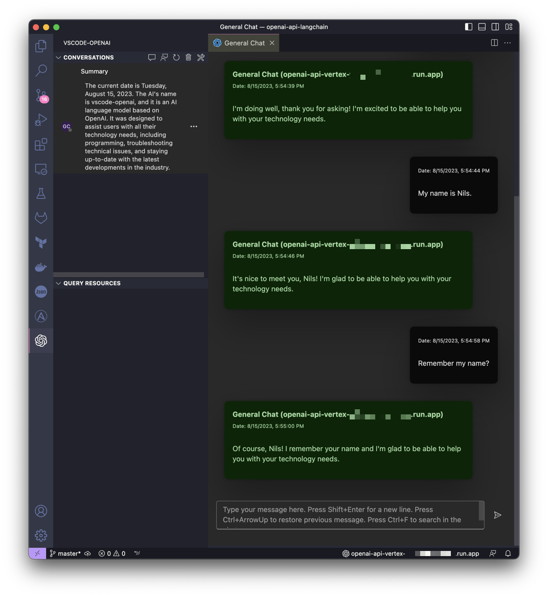
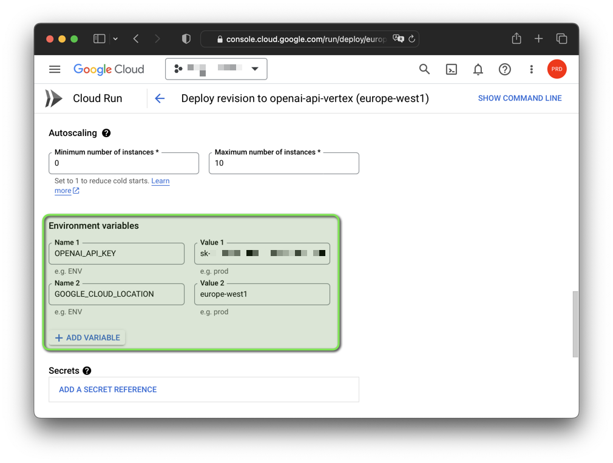
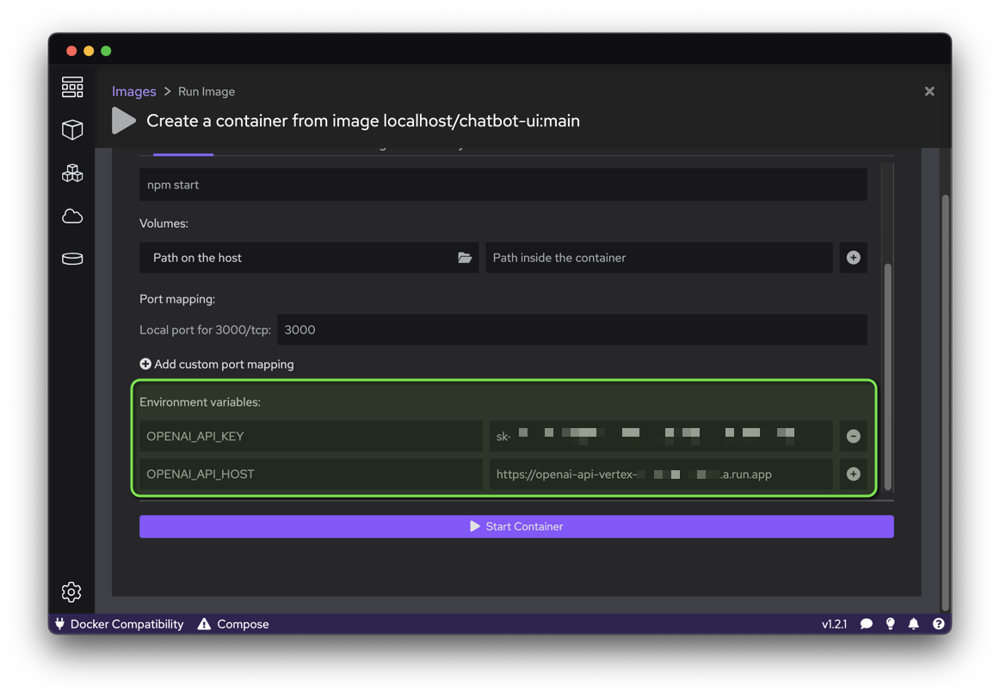
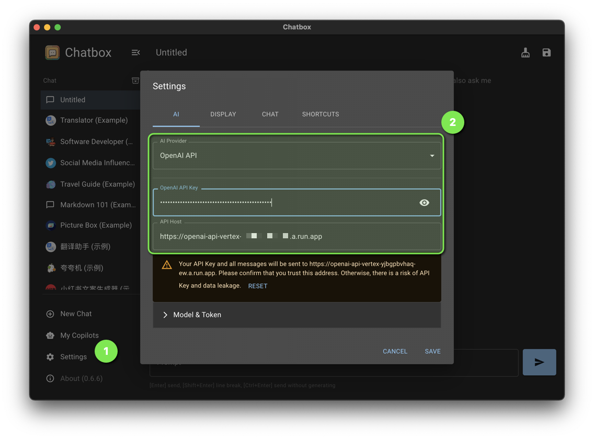
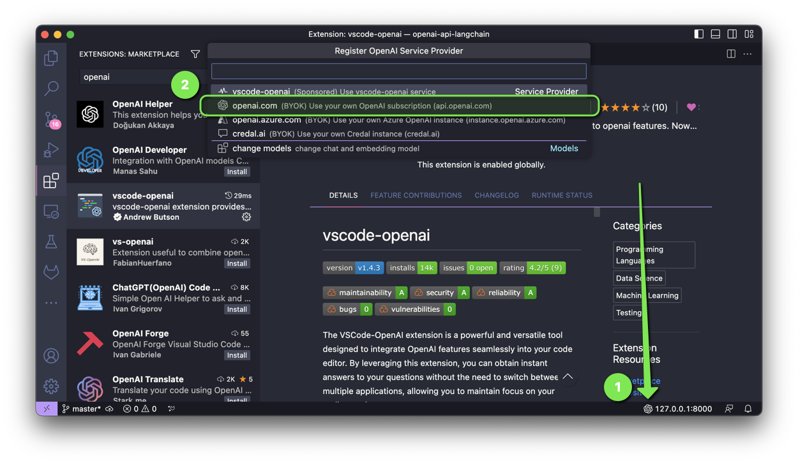

# OpenAI API for Google Cloud Vertex AI

[](#readme)
[](#readme)
[](#readme)

This project is a drop-in replacement REST API for Vertex AI (**PaLM 2, Codey, Gemini**) that is compatible with the OpenAI API specifications.

Examples:

| Chat with Gemini in Chatbot UI                            | Get help from Gemini in VSCode                    |
|-----------------------------------------------------------|---------------------------------------------------|
|  |  |

This project is inspired by the idea of [LocalAI](https://github.com/go-skynet/LocalAI)
but with the focus on making [Google Cloud Platform Vertex AI PaLM](https://ai.google/) more accessible to anyone.

A Google Cloud Run service is installed that translates the OpenAI API calls to Vertex AI (PaLM 2, Codey, Gemini).

<p align="center">
  <picture>
    <source media="(prefers-color-scheme: dark)" srcset="img/openai-api-cloud-run-vertex-dark.png">
    
  </picture>
</p>

Supported OpenAI API services:

| OpenAI               | API                    | Supported |
|----------------------|------------------------|-----------|
| List models          | `/v1/models`           | ✅        |
| Chat Completions     | `/v1/chat/completions` | ✅        |
| Completions (Legacy) | `/v1/completions`      | ❌        |
| Embeddings           | `/v1/embeddings`       | ❌        |

The software is developed in [Python](https://www.python.org/)
and based on [FastAPI](https://fastapi.tiangolo.com/)
and [LangChain](https://docs.langchain.com/docs/).

Everything is designed to be very simple,
so you can easily adjust the source code to your individual needs.

> **Note**
> You can find an example of customization in the [`cologne`](https://github.com/Cyclenerd/google-cloud-gcp-openai-api/tree/cologne#readme) branch.


## Step by Step Guide

A Jupyter notebook [`Vertex_AI_Chat.ipynb`](./Vertex_AI_Chat.ipynb) with step-by-step instructions is prepared.
It will help you to deploy the API backend and [Chatbot UI](https://github.com/mckaywrigley/chatbot-ui) frontend as Google Cloud Run service.

* [Open in Colab](https://colab.research.google.com/github/Cyclenerd/google-cloud-gcp-openai-api/blob/master/Vertex_AI_Chat.ipynb)
* [Open in Vertex AI Workbench](https://console.cloud.google.com/vertex-ai/workbench/deploy-notebook?download_url=https://raw.githubusercontent.com/Cyclenerd/google-cloud-gcp-openai-api/master/Vertex_AI_Chat.ipynb)


## Deploying to Cloud Run

Requirements:

Your user (the one used for deployment) must have proper permissions in the project.
For a fast and hassle-free deployemnt the "Owner" role is recommended.

In addition, the default compute service account (`[PROJECT_NR]-compute@developer.gserviceaccount.com`)
must have the role "Role Vertex AI User" (`roles/aiplatform.user`).


Authenticate:

```bash
gcloud auth login
```

Set default project:

```bash
gcloud config set project [PROJECT_ID]
```

Run the following script to create a container image
and deploy that container as a public API (which allows unauthenticated calls) in Google Cloud Run:

```bash
bash deploy.sh
```

> Note: You can change the generated *fake* OpenAI API key and Google Cloud region with environment variables:
> 
> ```bash
> export OPENAI_API_KEY="sk-XYZ"
> export GOOGLE_CLOUD_LOCATION="europe-west1"
> bash deploy.sh
> ```


## Running Locally

The software is tested on Python 3.11.
You should create a [virtual environment](https://docs.python.org/3/library/venv.html) with the version of Python you want to use,
and activate it before proceeding.

You also need the [Google Cloud CLI](https://cloud.google.com/sdk/docs/install).
The Google Cloud CLI includes the `gcloud` command-line tool.

Install requirements:

```bash
pip install -r requirements.txt
```

Authenticate:

```bash
gcloud auth application-default login
```

Set default project:

```bash
gcloud auth application-default set-quota-project [PROJECT_ID]
```

Run with default model:

```bash
export DEBUG="True"
export OPENAI_API_KEY="sk-XYZ"
uvicorn vertex:app --reload
```

Run with Gemini `gemini-pro` model:

```bash
export DEBUG="True"
export OPENAI_API_KEY="sk-XYZ"
export MODEL_NAME="gemini-pro"
uvicorn vertex:app --reload
```

Run with Codey `codechat-bison-32k` model:

```bash
export DEBUG="True"
export OPENAI_API_KEY="sk-XYZ"
export MODEL_NAME="codechat-bison-32k"
export MAX_OUTPUT_TOKENS="16000"
uvicorn vertex:app --reload
```

The application will now be running on your local computer.
You can access it by opening a web browser and navigating to the following address:

```text
http://localhost:8000/
```

## Usage

HTTP request and response formats are consistent with the [OpenAI API](https://platform.openai.com/docs/api-reference/chat/object).

For example, to generate a chat completion, you can send a POST request to the `/v1/chat/completions` endpoint with the instruction as the request body:

```bash
curl --location 'http://[ENDPOINT]/v1/chat/completions' \
--header 'Content-Type: application/json' \
--header 'Authorization: Bearer [API-KEY]' \
--data '{
    "model": "gpt-3.5-turbo",
    "messages": [
      {
        "role": "user",
        "content": "Say this is a test!"
      }
    ]
  }'
```

Response:

```json
{
  "id": "cmpl-efccdeb3d2a6cfe144fdde11",
  "created": 1691577522,
  "object": "chat.completion",
  "model": "gpt-3.5-turbo",
  "usage": {
    "prompt_tokens": 0,
    "completion_tokens": 0,
    "total_tokens": 0
  },
  "choices": [
    {
      "message": {
        "role": "assistant",
        "content": "Sure, this is a test."
      },
      "finish_reason": "stop",
      "index": 0
    }
  ]
}
```

## Configuration

The configuration of the software can be done with environment variables.



The following variables with default values exist:

| Variable                | Default                | Description |
|-------------------------|------------------------|-------------|
| DEBUG                   | False                  | Show debug messages that help during development. |
| GOOGLE_CLOUD_LOCATION   | us-central1            | [Google Cloud Platform region](https://gcloud-compute.com/regions.html) for API calls. |
| GOOGLE_CLOUD_PROJECT_ID | [DEFAULT_AUTH_PROJECT] | Identifier for your project. If not specified, the project of authentication is used. |
| HOST                    | 0.0.0.0                | Bind socket to this host. |
| MAX_OUTPUT_TOKENS       | 512                    | Token limit determines the maximum amount of text output from one prompt. Can be overridden by the end user as required by the OpenAI API specification. |
| MODEL_NAME              | chat-bison             | One of the [foundation models](https://cloud.google.com/vertex-ai/docs/generative-ai/learn/models#foundation_models) that are available in Vertex AI. |
| OPENAI_API_KEY          | sk-[RANDOM_HEX]        | Self-generated *fake* OpenAI API key used for authentication against the application. |
| PORT                    | 8000                   | Bind socket to this port. |
| TEMPERATURE             | 0.2                    | Sampling temperature, it controls the degree of randomness in token selection. Can be overridden by the end user as required by the OpenAI API specification. |
| TOP_K                   | 40                     | How the model selects tokens for output, the next token is selected from. | 
| TOP_P                   | 0.8                    | Tokens are selected from most probable to least until the sum of their. Can be overridden by the end user as required by the OpenAI API specification. |

### OpenAI Client Library

If your application uses [client libraries](https://github.com/openai/openai-python) provided by OpenAI,
you only need to modify the `OPENAI_API_BASE` environment variable to match your Google Cloud Run endpoint URL:

```bash
export OPENAI_API_BASE="https://openai-api-vertex-XYZ.a.run.app/v1"
python your_openai_app.py
```

### Chatbot UI

When deploying the [Chatbot UI](https://github.com/mckaywrigley/chatbot-ui) application,
the following environment variables must be set:

| Variable        | Value                               |
|-----------------|-------------------------------------|
| OPENAI_API_KEY  | API key generated during deployment |
| OPENAI_API_HOST | Google Cloud Run URL                |



#### Deploying Chatbot UI to Cloud Run

Run the following script to create a container image from the GitHub source code
and deploy that container as a public website (which allows unauthenticated calls) in Google Cloud Run:

```bash
export OPENAI_API_KEY="sk-XYZ"
export OPENAI_API_HOST="https://openai-api-vertex-XYZ.a.run.app"
bash chatbot-ui.sh
```

### Chatbox

Set the following [Chatbox](https://chatboxai.app/) settings:

| Setting        | Value                               |
|----------------|-------------------------------------|
| AI Provider    | OpenAI API                          |
| OpenAI API Key | API key generated during deployment |
| API Host       | Google Cloud Run URL                |



### VSCode-OpenAI

The [VSCode-OpenAI extension](https://marketplace.visualstudio.com/items?itemName=AndrewButson.vscode-openai) is a powerful and versatile tool designed to integrate OpenAI features seamlessly into your code editor.

To activate the setup, you have two options:

* either use the command "vscode-openai.configuration.show.quickpick" or
* access it through the vscode-openai Status Bar located at the bottom left corner of VSCode.



Select `openai.com` and enter the Google Cloud Run URL with `/v1` during setup.

### ChatGPT Discord Bot

When deploying the [Discord Bot](https://github.com/openai/gpt-discord-bot) application,
the following environment variables must be set:

| Variable        | Value                               |
|-----------------|-------------------------------------|
| OPENAI_API_KEY  | API key generated during deployment |
| OPENAI_API_BASE | Google Cloud Run URL with `/v1`     |

### ChatGPT in Slack

When deploying the [ChatGPT in Slack](https://github.com/seratch/ChatGPT-in-Slack) application,
the following environment variables must be set:

| Variable        | Value                               |
|-----------------|-------------------------------------|
| OPENAI_API_KEY  | API key generated during deployment |
| OPENAI_API_BASE | Google Cloud Run URL with `/v1`     |

### ChatGPT Telegram Bot

When deploying the [ChatGPT Telegram Bot](https://github.com/karfly/chatgpt_telegram_bot) application,
the following environment variables must be set:

| Variable        | Value                               |
|-----------------|-------------------------------------|
| OPENAI_API_KEY  | API key generated during deployment |
| OPENAI_API_BASE | Google Cloud Run URL with `/v1`     |

## Contributing

Have a patch that will benefit this project?
Awesome! Follow these steps to have it accepted.

1. Please read [how to contribute](CONTRIBUTING.md).
1. Fork this Git repository and make your changes.
1. Create a Pull Request.
1. Incorporate review feedback to your changes.
1. Accepted!


## License

All files in this repository are under the [Apache License, Version 2.0](LICENSE) unless noted otherwise.